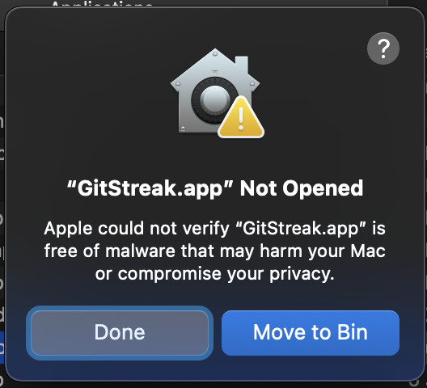
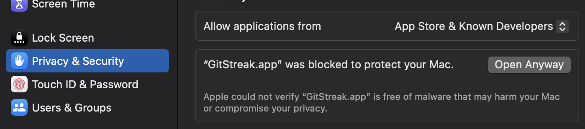

## Installation

### Via Homebrew (Recommended)

```bash
brew tap madrzak/gitstreakapp
brew install --cask gitstreak
```

## First Run Instructions

When launching GitStreak for the first time on macOS, you may see a security warning message that the app "cannot be opened because the developer cannot be verified" or that macOS "blocked it to protect your Mac".



This happens because the app is not signed with an Apple Developer certificate. Apple's Gatekeeper security feature blocks applications that aren't signed by default.

To run GitStreak anyway:

1. Go to System Preferences (or System Settings) → Security & Privacy → General
2. Look for the message about GitStreak being blocked and click "Open Anyway"



3. Confirm in the pop-up dialog that you want to open the app

### Why does this happen?

macOS requires apps to be signed with an Apple Developer certificate (which costs $99/year) to avoid showing these warnings. GitStreak is currently unsigned, but the app may be properly signed in the future if it gains enough usage.

The app is completely safe to use.
